# Qian-BMI500-hw11

**Name:** Jingyun Qian \\
**Contact:** jingyun.qian@emory.edu  \\
**Question Selected:** Question 2 

Link to Github: https://github.com/QianJingyun/Qian-BMI500-hw11/

## Summary of Findings
### Key insights:
  - Parameter Sensitivity: Infection and Recovery Rates
      Higher infection rates combined with low recovery probabilities lead to large, prolonged outbreaks (Fig 1), while lower infection rates or higher recovery probabilities significantly reduce peak infections and shorten outbreaks (Figs 2–4).

  - Parameter Sensitivity: Grid Size (Population Density)
      Smaller grid sizes (higher population density) facilitate larger outbreaks due to more frequent contacts (Fig 5), whereas larger grids dilute interactions and suppress sustained transmission (Fig 6).

  - Parameter Sensitivity: Population Size
      Small populations experience rapid but limited outbreaks that quickly burn out (Fig 7), while large populations with few initial infections have limited contact and transmission of disease, resulting in small outbreaks (Fig 8).

  - Parameter Sensitivity: Initial Infected Population
      A small initial infected population struggles to initiate an outbreak (Fig 9), whereas large initial infection sizes lead to immediate peaks and faster reduction of susceptibles (Fig 10).
  
  - Intervention Strategies: Social Distancing and Avoidance
      There are trade-offs of public health interventions. The "Original" scenario (Fig 11) represents an uncontrolled outbreak that would likely overwhelm public health systems. The "Reduced Movement" (Fig 12) shows how social distancing lowers the peak, buying time for healthcare response and reducing the maximum simultaneous burden, even if many people still get sick over a longer period. "Social Avoidance" (Fig 13) illustrates how strict lockdowns can suppress the virus. But this strategy leaves a large, non-immune (susceptible) population vulnerable to a resurgence of the virus if the interventions are no longer in place.

  - Parameter Sensitivity: Reduced Movement (Movement Probability Variations)
      Higher movement probabilities reduces intervention effects, resulting in large infection peaks (Fig 14), while reducing movement probability flattens the curve and preserves more susceptibles (Fig 15).

  - Parameter Sensitivity: Social Avoidance (Avoidance Probability Variations)
      Higher avoidance probability reduces transmission, which reduces new infections and maintains large non-immune population (Figs 16 and 17).

### Comparative model performance:

#### Parameter Sensitivity: Infection and Recovery Rates
  
*Fig 1*

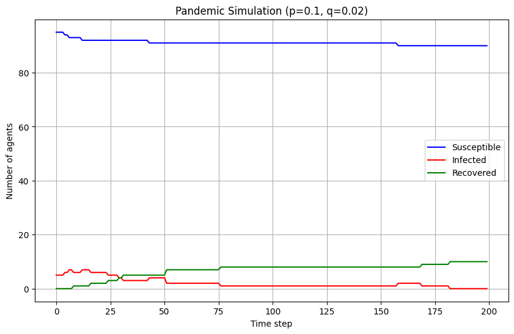  
*Fig 2*

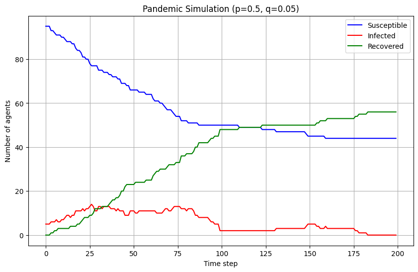  
*Fig 3*

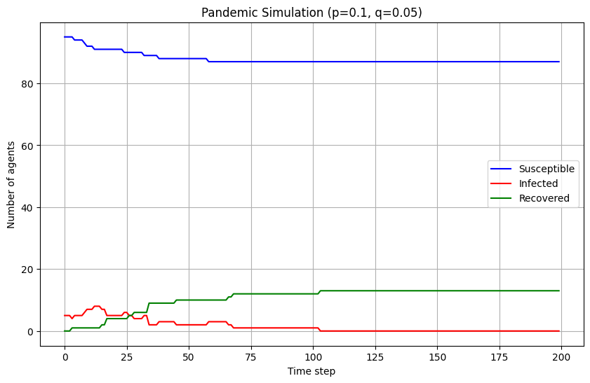  
*Fig 4*

In Fig 1, p=0.5 and q=0.02. The peak is high, reaching its infection peak at approximately 36 infected agents in 100 time steps. With low recovery probability q, individuals stay sick for a long time. The recovered cover grows slower than the infected curve till 100 time steps, and the susceptible population drops significnatly. 

In Fig 2, p=0.1 and q=0.02. The infection peak is very low, peaking aroung 7 agents in 15 time steps. Because of the low recovery probability, the infected population didn't drop to zero until 180 time steps, and the recovered population only increased by a small amount. Most people stay susceptible throughout the whole experiment. 

In Fig 3, p=0.5 and q=0.05. The infection peak is moderate, peaking aroung 17 agents in 27 time steps. With high infection rate and high recovery rate, infected individuals recover much faster, leading to a much smaller and earlier infection peak compared to Fig 1. The slope for recovered curve is much steeper and leaves a higher number of susceptible population.

In Fig 4, p=0.1 and q=0.05. The infection peak is also very low, peaking aroung 10 agents in 15 time steps. Similar to Fig 2, the infection rate is too low to spread the disease. With a high recovery rate, the infection drops to zero quickly, and most people remain susceptible. 

#### Parameter Sensitivity: Grid Size (Population Density)
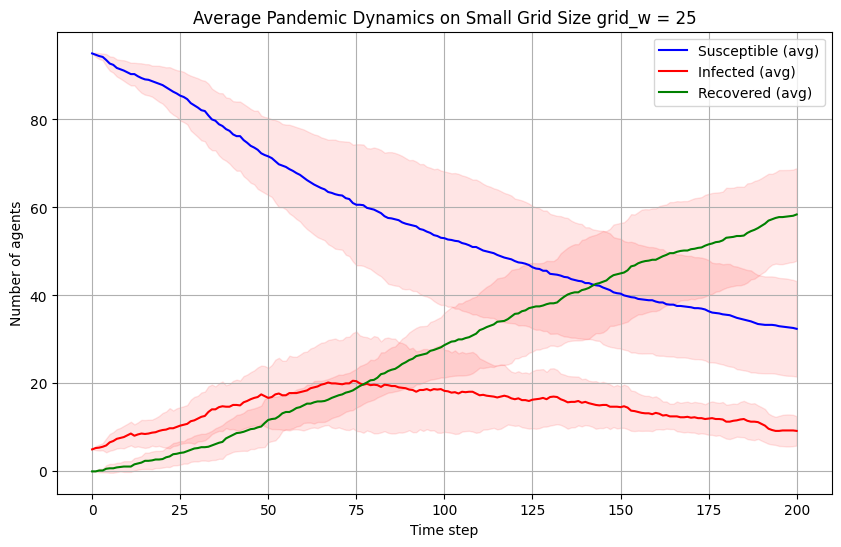  
*Fig 5*

  
*Fig 6*

Fig 5 (Small Grid Size = 25): In the simulation with a small grid size (grid_w = 25), the high population density facilitates a major outbreak. The infection curve shows a significant peak, rising to approximately 20 agents around time step 75. This strong spread leads to a substantial decline in the susceptible population, which drops from ~95 to below 40 agents by the end of the simulation.

Fig 6 (Large Grid Size = 175): In the simulation with a large grid size (grid_w = 175), the low population density stifles the pandemic. The infection peak is very low, reaching only ~6 agents around time step 25 before quickly declining. The low probability of agent interaction prevents sustained transmission. Consequently, the infection dies out, and the vast majority of the population remains susceptible.

#### Parameter Sensitivity: Population Size
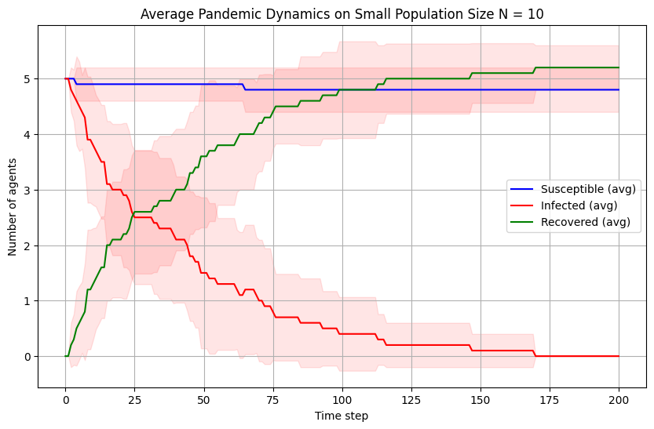  
*Fig 7*

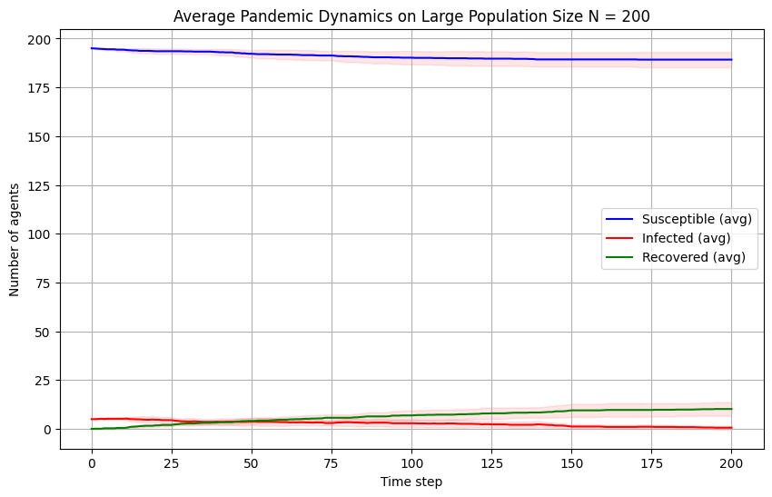  
*Fig 8*

Fig 7 (Small Population = 10): In the simulation with a small total population (N = 10, starting with 5 infected), the dynamics are rapid. The infection peak is its starting value of 5 agents, which then rapidly drops toward zero. With such a small pool of agents, the susceptible population remains almost unchanged, while the recovered curve rises quickly to 5, reflecting the recovery of the initial infected group.

Fig 8 (Large Population = 200): In the simulation with a large total population (N = 200, starting with ~5 infected), the infection fails to gain traction. Despite a large susceptible pool (~195 agents), the proportion of initial infectors is too small to initiate a widespread outbreak. The infection peak is extremely low, barely rising from 5 to 9 agents, and the susceptible population remains almost entirely untouched.

#### Parameter Sensitivity: Initial Infected Population
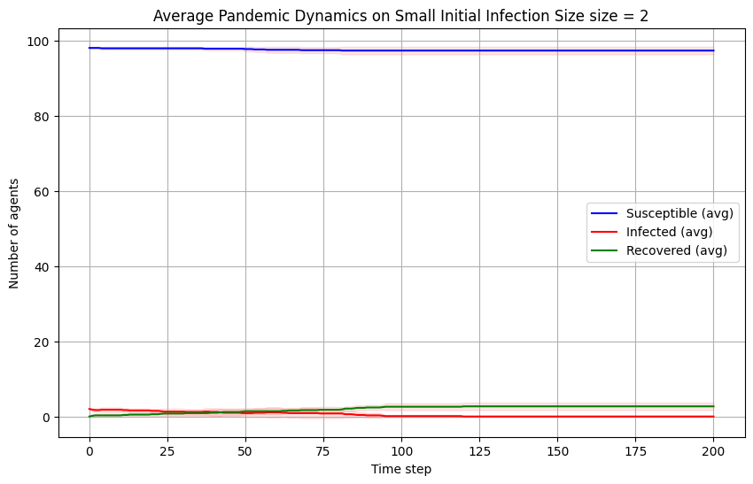  
*Fig 9*

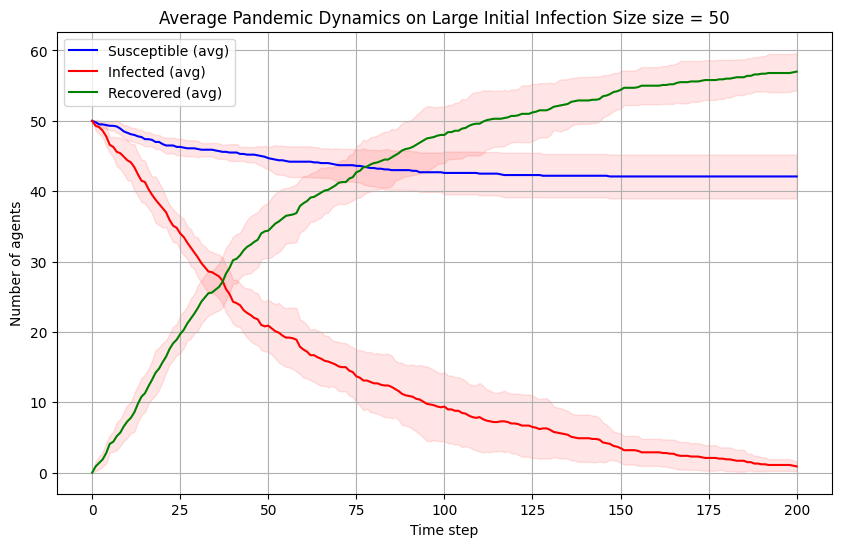  
*Fig 10*

Fig 9 (Small Initial Infection = 2): In the simulation with a small initial infection size (2 agents), the infection fails to launch. The infected peak is negligible, hovering near the starting value of 2 agents before declining. With such a small initial seed, the virus likely dies out before significant transmission can occur. As a result, the recovered population remains near zero, and the susceptible population is almost entirely unaffected.

Fig 10 (Large Initial Infection = 50): In the simulation with a large initial infection size (50 agents), the pandemic begins at its peak. The infected curve starts at 50 and immediately declines as agents recover, showing no initial growth phase. The recovered curve rises steeply, surpassing the infected curve around time step 40. This large initial outbreak burns through a portion of the population, causing the susceptible curve to drop from 50 to ~42 agents.

#### Intervention Strategies: Social Distancing and Avoidance
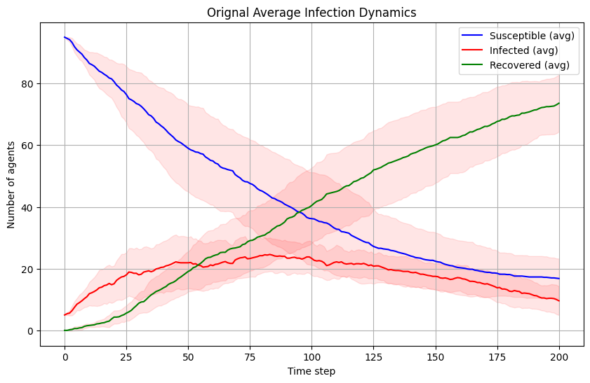  
*Fig 11*

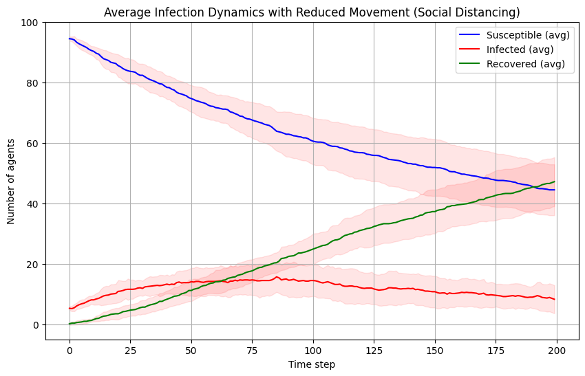  
*Fig 12*

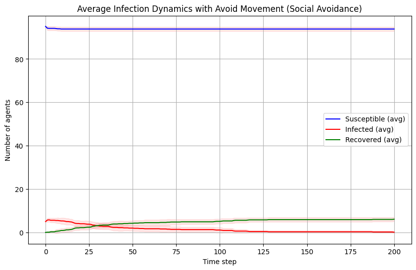  
*Fig 13*

Fig 11 (Original Dynamics - No Intervention): In the baseline simulation with no interventions, the infection spreads rapidly and widely. The infected curve shows a significant outbreak, rising from 5 agents to a high peak of approximately 25 infected agents around time step 80. This uncontrolled spread leads to a steep decline in the susceptible population, which falls from ~95 to ~18.

Fig 12 (Reduced Movement - Social Distancing): In the simulation with reduced movement, the curves are flatten. The infection peak is significantly lower, reaching only ~16 agents. The rate of infection is slower, leading to a broader, less severe peak. This intervention successfully slows the pandemic's spread, leaving a much larger susceptible population (~44) at the end of the simulation compared to the baseline.

Fig 13 (Avoid Movement - Social Avoidance): In the simulation with "avoid movement," the intervention is effectively suppresses the outbreak. The infection fails to spread in the population, showing a small peak of ~6 agents before quickly declining to zero by time step 100. The virus is unable to spread. Thus, the susceptible population remains almost entirely unaffected, staying at ~94 agents.

#### Reduced Movement (Reduce Movement Probability)
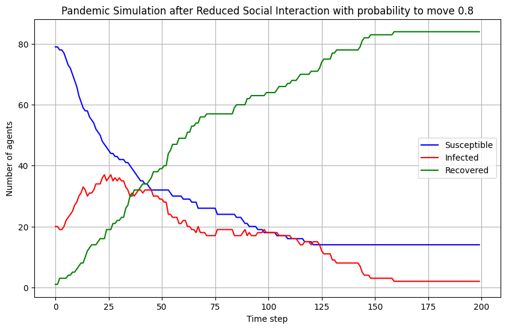  
*Fig 14*

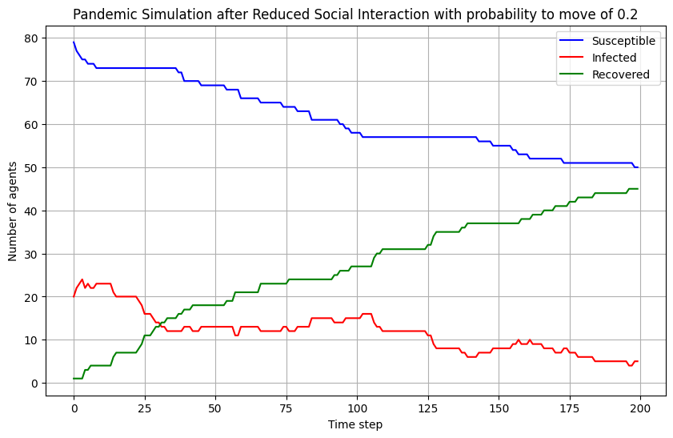  
*Fig 15*

Fig 14 (Move Probability 0.8): With a high 0.8 probability to move, the intervention is weak. The infection grows from its initial 20 agents to a significant new peak of approximately 37 agents around time step 35. This uncontrolled spread causes a rapid and large drop in the susceptible population, from 80 down to ~15.

Fig 15 (Move Probability 0.2): With a low 0.2 probability to move, the intervention is much stronger. It successfully flattens the curve by preventing a new infection peak; the infected curve slowly declines from its starting point. This saves a large portion of the susceptible population, which only drops from 80 to ~50.

#### Social Avoidance (Avoid Moving Towards Infected Probability)
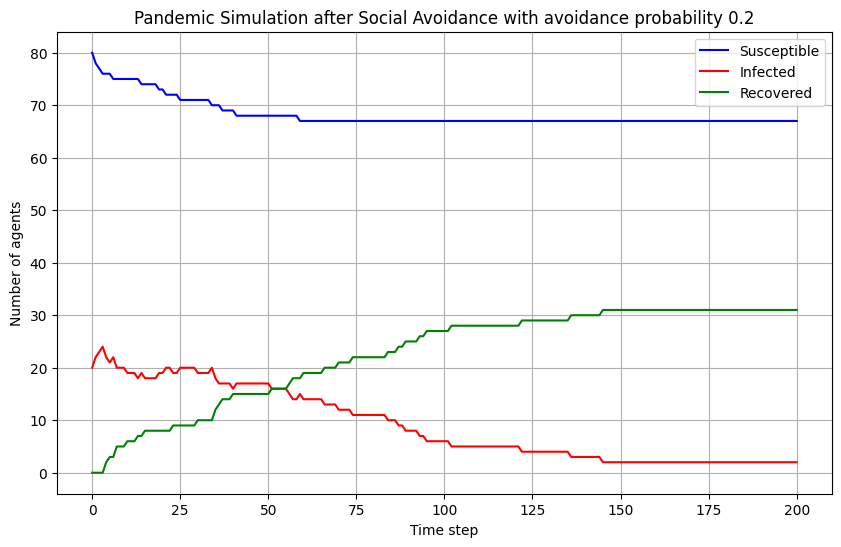  
*Fig 16*

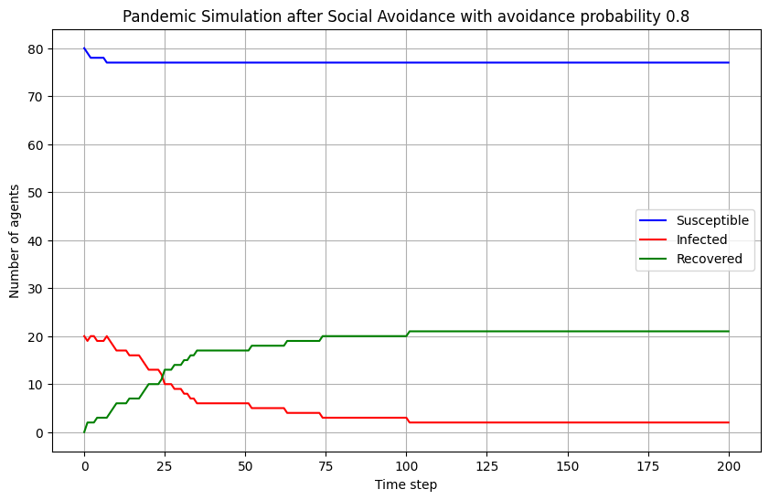  
*Fig 17*

Fig 16 (Avoidance Probability 0.2): With a low 0.2 probability of avoidance, the intervention is still quite effective. The infected curve shows no new peak and declines steadily from its start of ~24 agents. Some new transmission occurs, as the susceptible population drops from 80 to ~68, but the outbreak is largely contained.

Fig 17 (Avoidance Probability 0.8): With a high 0.8 probability of avoidance, the intervention is extremely effective and suppresses the outbreak almost immediately. The infected curve drops sharply from its start of ~21 agents, with no new peak. Critically, the susceptible population barely moves (80 to ~77), and the recovered curve levels off around ~21, indicating that almost no new infections occurred and only the initial infected group recovered.

### Relevance to model-based machine learning:

  - Agent based simulations provide interpretable results about spread of diease. The generated synthetic data and be useful for model-based machine learning model training and validation. 

  - Sensitivity analysis help understand how features impact results (spread of disease) better. This can help model-based machine learning on informed feature selection and model assumptions.

### Suggestions for future improvements:

  - To better capture real world scenarios, the model can incorporate social contact network that has properties (degree of nodes, density, clustering ...) like real-life scenarios. Instead of measuring the distance in a matrix without context, the proposed model can introduce spatially explicit movement patterns and mimic human interactions. In addition, mortality and vaccination could be considered to better model real-life scenarios.

## AI Tool Disclaimer
*Disclaimer: ChatGPT was used to help understand concepts, debug the code, and structure the README file. All final code and analysis are my own.*

## Repository Structure
- `/code.ipynb`: Source code and notebooks for Question 2.
- `/Figs/`: Saved images and plots.
- `/AI-Prompts.pdf`: PDF record of AI prompts.
- `LectureNotes_Model_Based_Machine_Learning_HW.pdf`: Assignment instructions.
